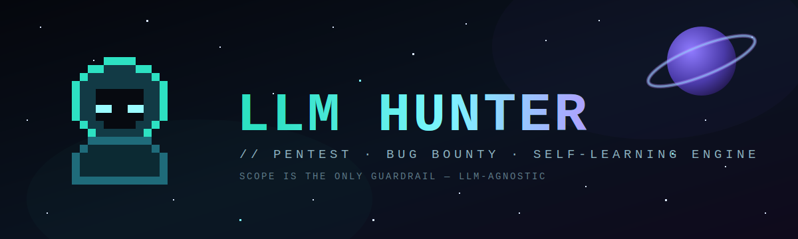
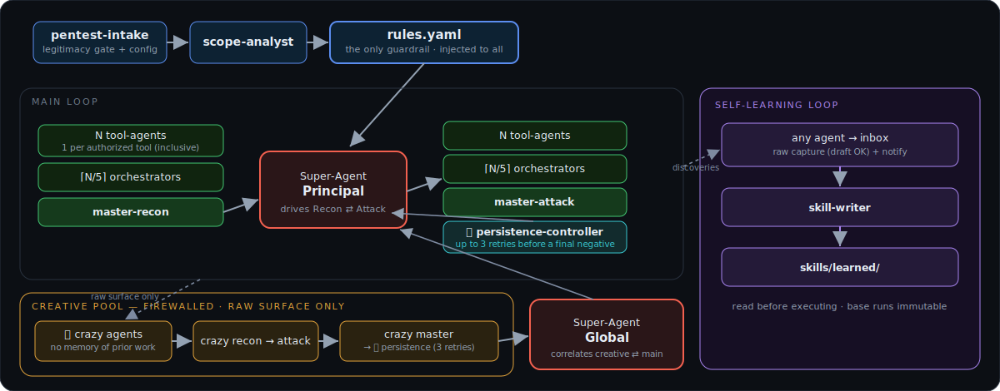

<p align="center">
  
</p>

# 🐛 LLM Hunter

**A layered, multi-agent engine that turns an LLM coding agent into a disciplined pentest / bug
bounty operator.** LLM-agnostic (Claude, GPT, or a single small model), self-improving, and built so
that the authorized scope is the only guardrail.

---

## Why this exists

This project was born out of frustration. Coding agents like Claude Code have enormous potential for
security work — but out of the box they aren't structured enough for real pentests. It was like a
**rough diamond**: the power was clearly there, but nobody quite knew how to cut it. Left alone, the
model tends to give up too early (*"this is closed, dead end"*) exactly when the finding is right in
front of it, restarts from scratch every engagement, and has no memory of what worked last time.

LLM Hunter is the cut. It wraps the raw capability in a methodology: a fixed set of agent roles, a
deterministic orchestration, hard scope discipline, and a learning loop so the engine gets sharper
every run.

## It evolves — with you

The engine **grows per user**. Every campaign feeds a learning loop: whenever an agent discovers a
bypass, a technique, or a methodology, it's captured and reformatted into a reusable skill. The more
you hunt, the deeper *your* instance's skill bank becomes — it starts to reflect how *you* work.

Power users will naturally accumulate the richest skill banks. If that's you: **please share your
skills back with the community.** That's how everyone's diamond gets sharper.

> ⚙️ This is an evolving project. Expect frequent updates, new agent roles, new skills, and broader
> LLM/runtime support over time.

## Core principle: scope is the only guardrail

There is no added "relevance" filter and no self-censorship on *"will this even work?"*. The engine
runs anything the program authorizes — and it authorizes **exactly** what the program allows, no more
and **no less**. Two filters exist; only one is applied:

| Filter | Applied? |
|---|---|
| **Authorization** — is the test permitted by `rules.yaml`? | ✅ strict, non-negotiable |
| **Relevance** — does the test have a chance of succeeding? | ❌ never |

Legitimacy is enforced up front: no campaign starts without a verified authorization (a bug bounty
program page, or a signed pentest engagement letter). **Use it only against targets you are
authorized to test.**

## How it works

<p align="center">
  
</p>

> A styled, interactive version lives in [`docs/pipeline_schema.html`](docs/pipeline_schema.html) (open it in a browser).

**The squad formula.** Tool-agents = **N** (one per *authorized* tool, inclusive — even low-utility
tools are deployed). Orchestrators = **ceil(N/5)** (one per pool of 5). Masters aggregate into a
single conclusion.

**Anti-give-up.** A *persistence-controller* intercepts every negative verdict and forces up to 3
retries before a "no vulnerability" is accepted as final.

**Creative pool ("crazy agents").** A firewalled set of agents receives *only the raw attack
surface* — never prior conclusions or "already tried" verdicts — so their creativity is never
poisoned by defeatism. A *global* super-agent correlates their raw output back into the main loop.

**Learning loop.** Discoveries are captured raw by any agent, then a dedicated `skill-writer`
reformats them into clean, reusable skills. Only the skill/config layer is mutable — the base runs
(workflows, agent roles) are immutable.

**Budget modes.** `peu` / `normal` / `beaucoup` scale the creative pool size *and* retry depth
together, since both draw on the same token budget.

## LLM-agnostic by design

Models are expressed as **tiers** (`cheap` / `mid` / `strong`), not vendor names — see
[`docs/MODEL_STRATEGY.md`](docs/MODEL_STRATEGY.md).

- **Multi-model runtime** (Claude Code, etc.): each tier runs on its **real** model — a `cheap` role
  actually runs the small model, never a large one in disguise (tokens = money).
- **Single-model runtime**: same model everywhere, with **reasoning effort** dialed per tier
  (cheap = low … strong = high). The cost hierarchy is preserved via effort instead of model.

## Repository layout

```
.claude-plugin/plugin.json   plugin manifest (Claude Code plugin)
commands/              slash commands (/pentest · /pentest-rerun)
agents/                one file per role (10 roles), model tier in frontmatter
skills/                reusable methodology (+ learned/ skill bank grown per run)
workflows/             orchestration scripts (recon · attack · crazy · main-loop)
rules/                 SCHEMA.md — the rules.yaml format (generated per engagement, never shipped filled-in)
docs/                  ARCHITECTURE.md · MODEL_STRATEGY.md · pipeline_schema.html
TOOLS_CATALOG.md       universal tool menu + authorization metadata
CLAUDE.md              the operating contract (guardrails & conventions)
```

## Install (Claude Code plugin)

LLM Hunter ships as a **Claude Code plugin**. Install it, then drive it from two slash commands:

- **`/pentest`** — runs the full pipeline end-to-end (legitimacy gate → intake → scope-analyst →
  recon → attack → creative pool → correlation → learning → report).
- **`/pentest-rerun`** — reruns the pipeline on newly surfaced findings, reusing the existing
  `rules.yaml` and the grown skill bank.

## Status

⚙️ **Skill-driven and runnable.** The engine runs end-to-end: the `/pentest` command (or the
`pentest-intake` skill) drives the whole pipeline, spawning real subagents for each role and tool
(recon → attack → creative pool → correlation → learning). The orchestrator always delegates to real
subagents — it never takes over and runs the tests inline. Every run **always ends with a report**,
even when zero findings, and then asks whether to rerun on the new findings. All 10 roles, 5 skills,
and 4 workflows are wired together and actively exercised — not inert stubs. It's still actively
evolving: expect new roles, more community skills, and broader runtime support to land regularly.

## How to run

Run the **`/pentest`** command (or invoke the **`pentest-intake`** skill) to start a campaign. It runs
the legitimacy gate + asks the few config questions (scope source, budget mode, learning), then hands
off to `scope-analyst` to generate a concrete `rules.yaml` for the engagement. From there it
orchestrates the full pipeline — recon → attack → creative pool → correlation → learning — by spawning
real subagents for each role and tool; the orchestrator delegates and never runs the tests itself.

The pipeline **always ends with a report**, even if zero findings, and after each run it asks whether
to rerun on the new findings (**`/pentest-rerun`**).

The `workflows/*.js` scripts mirror the same orchestration for the Workflow-tool execution path. The
generated `rules.yaml` is engagement-specific and stays local — it is never shipped.

## Contributing

Found a technique the engine should know? Package it as a skill under `skills/learned/` and
open a PR. Community skills make every hunter's engine sharper.

## ⚠️ Authorized use only

LLM Hunter is for **authorized** security testing: public/private bug bounty programs and pentests
under signed contract. The legitimacy gate will refuse to start without proof of authorization. Do
not point it at anything you don't have explicit permission to test.
